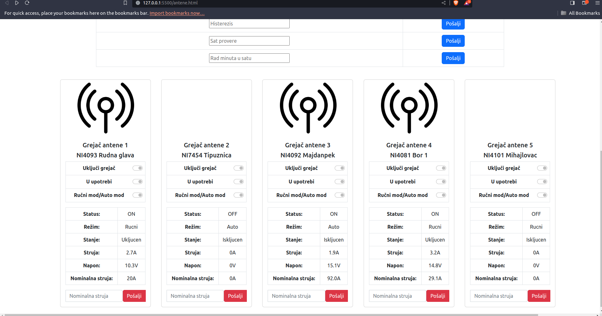

 

  

<h3 align="center">Antena sensor</h3>

  

    ·
    <a href="https://github.com/TheGoldenCloud/Antena-Sensors/issues">Report Bug</a>
    ·
    <a href="https://github.com/TheGoldenCloud/Antena-Sensors/issues">Request Feature</a>
  

<!-- ABOUT THE PROJECT -->
## About The Project

<!-- [![Product Name Screen Shot][product-screenshot]](https://example.com) -->

<!--  -->

This app controls and monitors heat sensors. The app controls reads and writes to PLC device so it is just for representational purpose. 

(<a href="#readme-top">back to top</a>)

### Built With

(<a href="#readme-top">back to top</a>)

